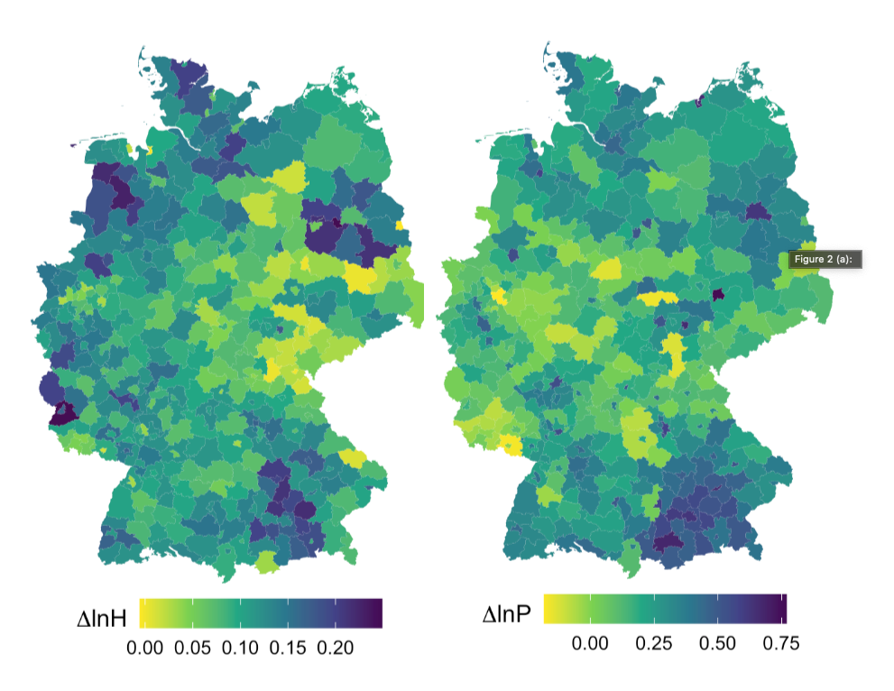
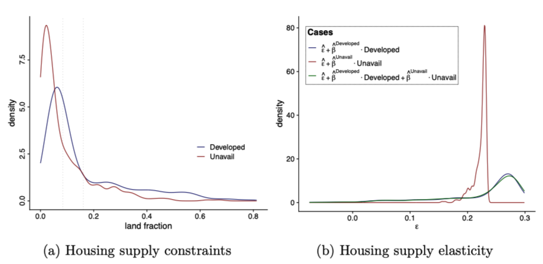
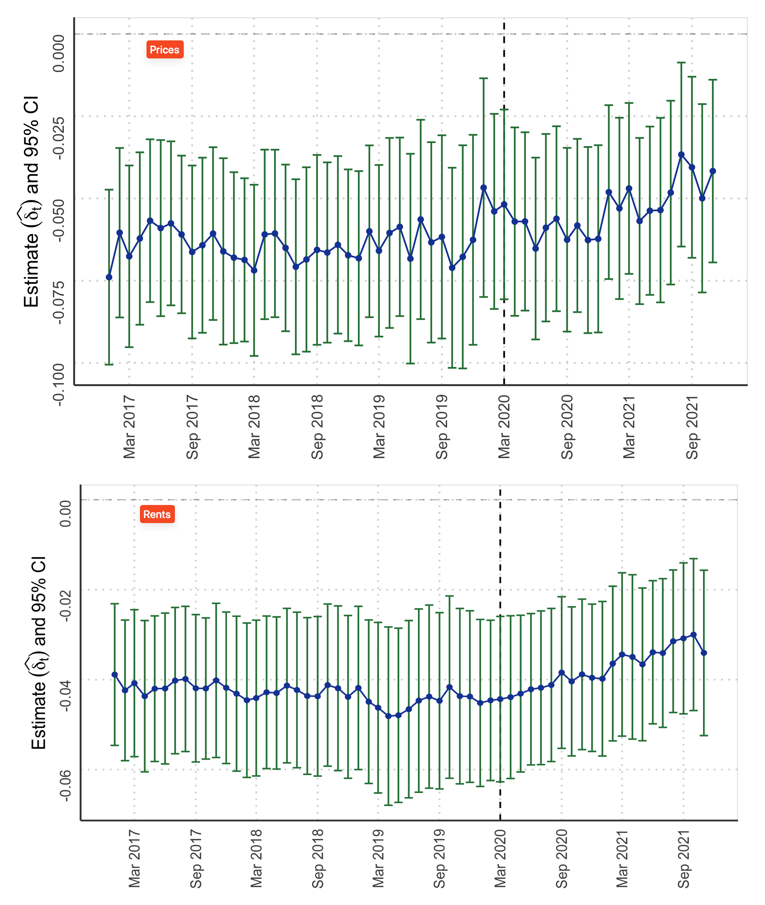
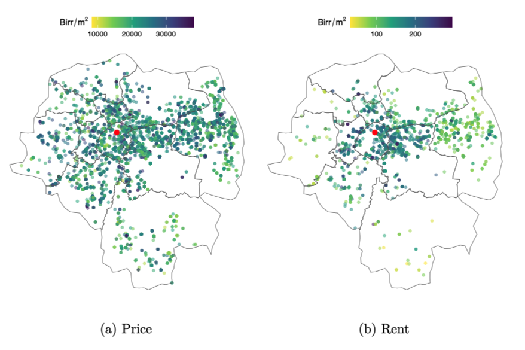
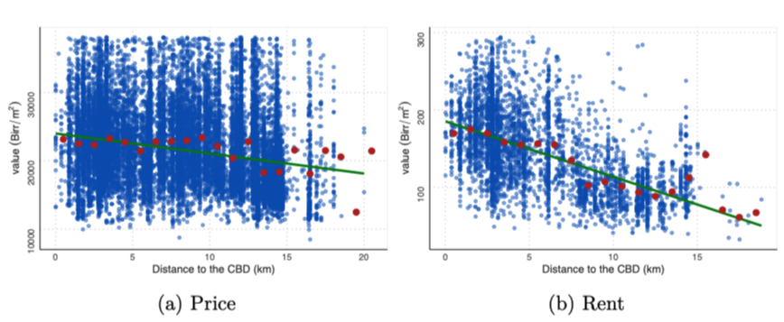

# Dissertation

This repository contains information about my research projects that make up my dissertation.

> [!NOTE]
>
> Title: **Essays on Housing Supply and the Monocentric City Model**
>
> Available at the University of Duisburg-Essen library. [PDF](https://duepublico2.uni-due.de/receive/duepublico_mods_00082247)

## Chapters & Replication Code

### Geographic Constraints and the Housing Supply Elasticity in Germany. --- [*Ruhr Economic Papers #1003*](https://www.rwi-essen.de/en/publications/scientific/ruhr-economic-papers/detail/geographic-constraints-and-the-housing-supply-elasticity-germany) --- latest version [PDF](https://uni-duisburg-essen.sciebo.de/s/km7tQzcygRQjwp6) | [Code](https://github.com/eyayaw/housing-supply-elasticity-in-germany)

> Fig: **Housing supply and price growth in Germany: 2008-2019**
>
> *Notes*: *Prices are in € per m². This densities the heterogeneity in supply elasticity: the distributions of the housing supply constraints and the housing supply elasticity estimates across districts.*

Abstract

> *The study estimates the housing supply elasticity and the impact of geographic constraints in Germany from 2008-2019 using the Bartik instrument. The results show that the housing supply is, on average, inelastic, with a floorspace elasticity of 0.22 and a units elasticity of 0.25. The study also reveals that geographical constraints partially affect the housing supply elasticity across districts. Notably, high development intensity decreases the elasticity, while the unavailability of land for development due to restrictive geography has no significant impact on the housing supply elasticity. The housing supply elasticity estimates may prove useful for calibrating quantitative urban models in Germany.*

### The impact of COVID-19 on real estate markets in Germany. --- German Economic Review [PDF](https://papers.ssrn.com/sol3/papers.cfm?abstract_id=4700238) | [Code](https://github.com/eyayaw/de-donut-effect)

> Fig: **Estimates for the price and rent gradients**
>
> *Notes*: *This figure shows the estimated slopes of the price and rent gradients*

Abstract

> *The COVID-19 pandemic has disrupted established urban patterns. The literature on the impact of the pandemic on real estate markets in the US has shown a significant increase in the demand for suburban housing, resulting in a considerable increase in suburban prices compared to those in the city center (termed the "donut effect"). However, the German housing market did not experience such drastic changes. To examine price and rent adjustments during the pandemic, we analyze detailed housing data and find little evidence supporting the donut effect seen in the US. Apartment rents increase in suburban areas, while house prices do not change significantly. Examining the role of amenities, we find no explanation for price and rent differences between the central business district (CBD) and suburbs. The differences between the two markets may be attributed to cultural and structural distinctions. Our analysis, which includes data on population patterns and migration behavior, reveals that residents in Germany exhibit a slower-moving trend. Our findings remain robust across different settings and subsets of cities.*

> --- Coauthored with [Patrick Thiel](https://github.com/pthie)

### Testing the Gradient Predictions of the Monocentric City Model in Addis Ababa. [PDF](https://papers.ssrn.com/sol3/papers.cfm?abstract_id=4803607) | [Code](https://github.com/eyayaw/the-monocentric-city-gradients-addis-ababa)

> Fig: **Rent Gradient in Addis Ababa, 2023**
>
> *Notes*: *Both panels show the average house prices and rents in Birr per square meter in 2023. In the scatterplot, blue dots represent individual property values, while red points represent averages within 2 km distance bins. The green lines are fitted over the blue data points. The red point indicates the CBD, Meskel Square.*

Abstract

> *This study presents new empirical evidence for the monocentric city model in a developing country, using unique real estate data for Addis Ababa. The study confirms two of the key predictions of the model: the negative rent and the negative structural density gradients. Both house prices and rents decrease as we move away from the center of Addis Ababa. Using building footprint datasets, the study also demonstrates that the structural density (measured by building height) strongly decreases with distance to the Central Business District (CBD). This study provides a comprehensive georeferenced real estate dataset for Addis Ababa, the first study to do so. The findings highlight the enduring relevance of the monocentric city model in cities in developed and developing countries.*

